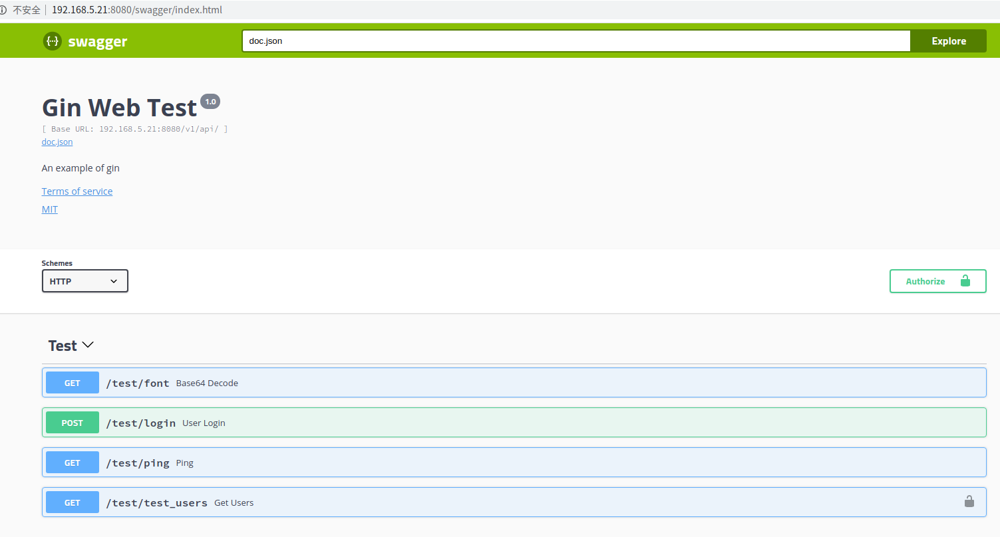
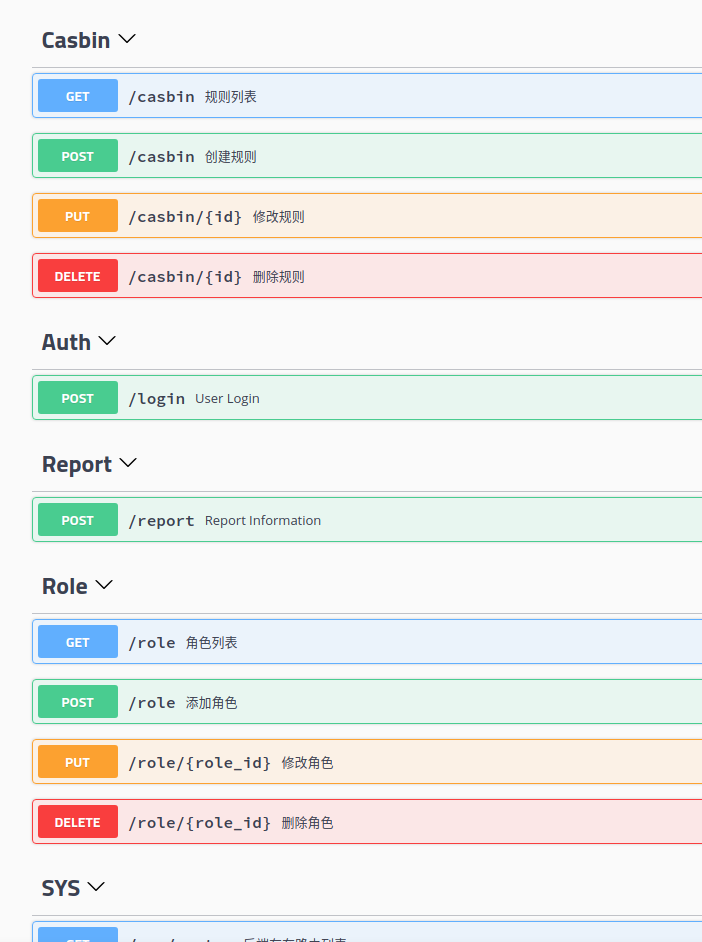

## Gin Web Admin

## First Run

```bash
cp conf/app.ini.example conf/app.ini
go mod download
go run main.go
```

## Cross Compile

### Windows

```bash
CGO_ENABLED=0 GOOS=windows GOARCH=amd64  go build -a -ldflags '-extldflags "-static"' .
```

### Linux

```bash
CGO_ENABLED=0 go build -a -ldflags '-extldflags "-static"' .
```


#### Logs
```bash
$ go run main.go 
2020/06/28 15:42:40 [info] Redis connected 192.168.3.5:6379 DB: 0
2020/06/28 15:42:40 PONG
[GIN-debug] [WARNING] Running in "debug" mode. Switch to "release" mode in production.
 - using env:	export GIN_MODE=release
 - using code:	gin.SetMode(gin.ReleaseMode)

[GIN-debug] POST   /v1/api/login             --> gin-web-admin/app/controllers/v1/auth.UserLogin (4 handlers)
[GIN-debug] POST   /v1/api/user              --> gin-web-admin/app/controllers/v1/user.CreateUser (7 handlers)
[GIN-debug] GET    /v1/api/user              --> gin-web-admin/app/controllers/v1/user.GetUsers (7 handlers)
[GIN-debug] PUT    /v1/api/user/logout       --> gin-web-admin/app/controllers/v1/auth.UserLogout (7 handlers)
[GIN-debug] PUT    /v1/api/user/change_password --> gin-web-admin/app/controllers/v1/auth.ChangePassword (7 handlers)
[GIN-debug] GET    /v1/api/user/logged_in    --> gin-web-admin/app/controllers/v1/auth.GetLoggedInUser (7 handlers)
[GIN-debug] GET    /v1/api/role              --> gin-web-admin/app/controllers/v1/role.GetRoles (7 handlers)
[GIN-debug] POST   /v1/api/role              --> gin-web-admin/app/controllers/v1/role.CreateRole (7 handlers)
[GIN-debug] PUT    /v1/api/role/:role_id     --> gin-web-admin/app/controllers/v1/role.UpdateRole (7 handlers)
[GIN-debug] DELETE /v1/api/role/:role_id     --> gin-web-admin/app/controllers/v1/role.DeleteRole (7 handlers)
[GIN-debug] GET    /v1/api/casbin            --> gin-web-admin/app/controllers/v1/casbin.GetCasbinList (7 handlers)
[GIN-debug] POST   /v1/api/casbin            --> gin-web-admin/app/controllers/v1/casbin.CreateCasbin (7 handlers)
[GIN-debug] PUT    /v1/api/casbin/:id        --> gin-web-admin/app/controllers/v1/casbin.UpdateCasbin (7 handlers)
[GIN-debug] DELETE /v1/api/casbin/:id        --> gin-web-admin/app/controllers/v1/casbin.DeleteCasbin (7 handlers)
[GIN-debug] GET    /v1/api/sys/router        --> gin-web-admin/app/controllers/v1/sys.GetRouterList (7 handlers)
[GIN-debug] GET    /v1/api/sys/menu_list     --> gin-web-admin/app/controllers/v1/sys.GetMenuList (7 handlers)
[GIN-debug] POST   /v1/api/test/ping         --> gin-web-admin/app/controllers/v1/index.Ping (5 handlers)
[GIN-debug] GET    /v1/api/test/ping         --> gin-web-admin/app/controllers/v1/index.Ping (5 handlers)
[GIN-debug] GET    /v1/api/test/font         --> gin-web-admin/app/controllers/v1/index.Test (5 handlers)
[GIN-debug] POST   /v1/api/report            --> gin-web-admin/app/controllers/v1/report.Report (5 handlers)
[GIN-debug] GET    /swagger                  --> gin-web-admin/routers.InitSwaggerRouter.func1 (4 handlers)
[GIN-debug] GET    /swagger/*any             --> github.com/swaggo/gin-swagger.CustomWrapHandler.func1 (4 handlers)
INFO[0000] [info] start http server listening :8080      func="main.main:77" name=main-logger
INFO[0000] [info] Actual pid is 625                      func="main.main:78" name=main-logger

```

## Swagger Docs

### Preview





Access ```BASE_URL/swagger/index.html``` view docs.

Please check the instructions for use.
[gin-swagger](https://github.com/swaggo/gin-swagger)

### Generate
```bash
$ swag init
2019/08/22 16:17:11 Generate swagger docs....
2019/08/22 16:17:11 Generate general API Info, search dir:./
2019/08/22 16:17:11 create docs.go at  docs/docs.go
2019/08/22 16:17:11 create swagger.json at  docs/swagger.json
2019/08/22 16:17:11 create swagger.yaml at  docs/swagger.yaml
```

## Parameter Verification

### 1.Defining structure

use `validator.v10` Docs: [validator.v10](https://pkg.go.dev/github.com/go-playground/validator/v10)

```golang
type Page struct {
    P uint `json:"p" form:"p" validate:"required,numeric,min=1"`
    N uint `json:"n" form:"n" validate:"required,numeric,min=1"`
}
```

### 2.Binding Request Parameters

```golang
    var p Page
    if err := c.ShouldBindQuery(&p); err != nil {
        return err, "参数绑定失败,请检查传递参数类型！", 0, 0
    }
```

### 3.Verify Binding Parameters

```golang
    err, parameterErrorStr := common.CheckBindStructParameter(p, c)
```

### Complete example

```golang

type Page struct {
    P uint `json:"p" form:"p" validate:"required,numeric,min=1"`
    N uint `json:"n" form:"n" validate:"required,numeric,min=1"`
}

// GetPage get page parameters
func GetPage(c *gin.Context) (error, string, int, int) {
    currentPage := 0

    // 绑定 query 参数到结构体
    var p Page
    if err := c.ShouldBindQuery(&p); err != nil {
        return err, "参数绑定失败,请检查传递参数类型！", 0, 0
    }

    // 验证绑定结构体参数
    err, parameterErrorStr := common.CheckBindStructParameter(p, c)
    if err != nil {
        return err, parameterErrorStr, 0, 0
    }

    page := com.StrTo(c.DefaultQuery("p", "0")).MustInt()
    limit := com.StrTo(c.DefaultQuery("n", "15")).MustInt()
    
    if page > 0 {
       currentPage = (page - 1) * limit
    }

    return nil, "", currentPage, limit
}
```

## Features

- [Gorm](https://github.com/go-gorm/gorm)
- [Swagger(swag)](https://github.com/swaggo/swag)
- [Gin-gonic](https://github.com/gin-gonic/gin)
- [Go-ini](https://github.com/go-ini/ini)
- [Redis](https://github.com/gomodule/redigo)
- [Air](https://github.com/cosmtrek/air)
- [JWT](https://github.com/dgrijalva/jwt-go)
- [Casbin](https://github.com/casbin/casbin)
- [Gorm-adapter](https://github.com/casbin/gorm-adapter)

## License

MIT
