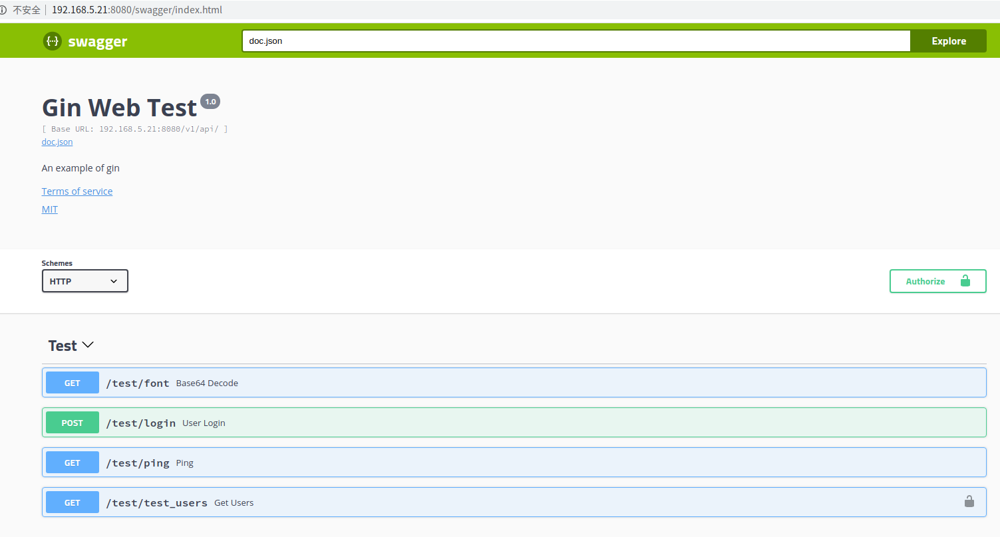
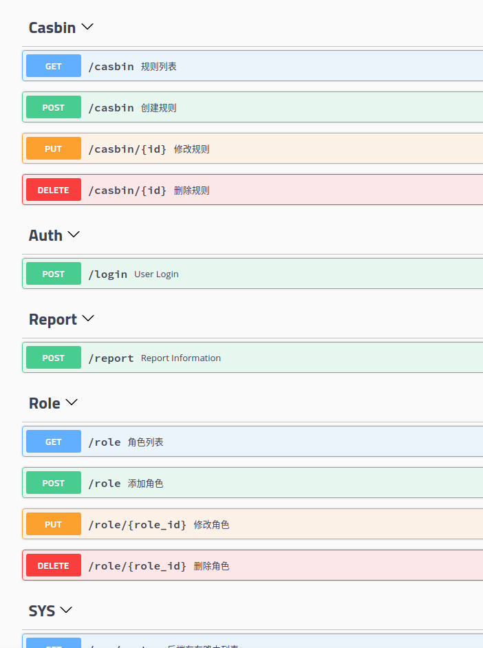

# Gin Web Admin

## Web admin frontend project

[web-admin-frontend](https://github.com/userfhy/web-admin-frontend)

## First Run

```bash
cp conf/app.toml.example conf/app.toml
go mod download
go run main.go
```

### 指定配置文件/运行模式

服务默认读取 `conf/app.toml`，如果需要为不同环境指定独立配置，可以：

```bash
export APP_CONFIG_PATH=/path/to/your/app.toml
export RUN_MODE=release # 可选：覆盖配置中的 run_mode
go run ./cmd/server
```

也可以直接在代码中调用 `server.Run(server.Options{ConfigPath: "/path/to/app.toml"})` 或 `setting.SetConfigPath()`，更适合单元测试/自定义启动器。

### 自定义启动逻辑

如果你需要嵌入到自己的 CLI/服务中，可以复用 `cmd/server` 暴露的选项，控制配置文件和优雅退出时间：

```go
package main

import (
    "time"

    "gin-web-admin/cmd/server"
)

func main() {
    _ = server.Run(server.Options{
        ConfigPath:      "./conf/app.toml",
        ShutdownTimeout: 10 * time.Second,
    })
}
```

需要在其它程序中重用数据库、Redis 等依赖时，可以直接使用 `internal/bootstrap`：

```go
package main

import (
    "gin-web-admin/internal/bootstrap"
)

func main() {
    container, err := bootstrap.Initialize(bootstrap.Options{
        ConfigPath: "./conf/app.toml",
    })
    if err != nil {
        panic(err)
    }

    db := container.DB
    redisPool := container.RedisPool
    _ = db
    _ = redisPool
}
```

## 新增模块/接口改动清单

当前代码正从旧的包级函数演进到“Service + Handler + Router”依赖注入模式，新增业务模块建议按以下步骤进行，避免遗漏：

1. **模型与迁移（可选）**：
   - 在 `app/models` 定义数据结构与查询函数，复用 `TablePrefix`、`utils.Pagination`、`model.BuildCondition` 等基础能力。
   - 如需新表或字段，请在 `sql/` 下维护迁移脚本，禁止在 `model.Setup()` 中直接 AutoMigrate 生产库。
2. **Service 层**：
   - 在 `app/service/v1/<module>` 新建 `service.go`，声明 `type Service struct { store *data.Store }` 并提供 `NewService(store *data.Store)`。
   - 所有业务方法写成接收者方法，必要时新增接口方便 mock，避免再暴露包级全局函数。
   - 若需要访问 Redis，优先使用 `utils/gredis` 提供的封装（如 `SetWithTTL`、`ExistsKey`，后续也可扩展），统一复用连接池。
3. **Controller/Handler**：
   - `app/controllers/v1/<module>` 下实现 `Handler`，构造函数注入 Service。
   - Handler 方法内统一使用 `common.Gin`、`utils.GetPagination`、`utils/code` 等工具，保持错误码/响应格式一致。
4. **Router**：
   - `routers/<module>_router.go` 仅负责路由注册，签名形如 `Init<Module>Router(group *gin.RouterGroup, handler *<module>Controller.Handler)`。
   - 避免在路由层创建 Service/Handler，更不要直接引用包级 controller 函数。
5. **依赖注入（server → router → handler）**：
   - 在 `routers/router.go` 的 `Dependencies` 增加 `<Module>Service *<module>Service.Service` 字段，并在 `InitRouter` 中实例化 `<module>Handler := <module>Controller.NewHandler(deps.<Module>Service)`。
   - `cmd/server/server.go` 中：在 bootstrap 后创建 `<module>Svc := <module>Service.NewService(container.Store)`，并填入构造 `routers.Dependencies` 时的 `<Module>Service`。
6. **缓存/生命周期**：
   - 模块若需要后台任务（如 SSE 广播、定时同步），在 `cmd/server/server.go` 或专门的启动器中初始化，禁止在 Handler 内直接起 goroutine。
   - 需要单独运行 Service 层以便 CLI/测试时，可直接复用 `internal/bootstrap` 返回的 `container.Store`、`container.NewEngine()` 等依赖。
   - 使用 Redis 做缓存或黑名单时，统一调用 `utils/gredis`，可选同步 (`SetJSON`/`DeleteKeys`) 或异步 (`SetJSONAsync`/`DeleteKeysAsync`) 接口。
   - 写操作完成后务必调用对应的失效函数（例如 `sitePublicService.InvalidatePublicContent`、`sysService.InvalidateRouteCache`），避免脏数据长时间驻留缓存。
7. **文档与权限**：
   - 使用 `swag init` 更新 `docs/swagger.*`；若新增公开接口，别忘了在 `routers/site_public_router.go` 等路由文件中注册。
   - RBAC/Casbin 场景补充菜单 SQL、Casbin 策略或角色菜单映射，保持前后端一致。
8. **验证**：
   - 执行 `GOCACHE=/tmp/.gocache go test ./...`，必要时补充单元/集成测试。
   - 运行 `go run ./cmd/server`，通过 Swagger 或 `curl` 确认新路由可访问，日志无异常。

> 小贴士：如果只是为现有模块增加接口，也应复用 `Handler` + DI 的方式，避免重新引入全局状态。

## Cross Compile

### Windows

```bash
CGO_ENABLED=0 GOOS=windows GOARCH=amd64  go build -a -ldflags '-extldflags "-static"' .
```

### Linux

```bash
CGO_ENABLED=0 go build -a -ldflags '-extldflags "-static"' .
```

## Logs

```bash
$ go run main.go 
2020/06/28 15:42:40 [info] Redis connected 192.168.3.5:6379 DB: 0
2020/06/28 15:42:40 PONG
[GIN-debug] [WARNING] Running in "debug" mode. Switch to "release" mode in production.
 - using env:   export GIN_MODE=release
 - using code:  gin.SetMode(gin.ReleaseMode)

INFO[2025-03-16 14:18:39] Redis connected 192.168.1.128:6379 DB: 3      caller="main.init.0:53" service=sse-service
INFO[2025-03-16 14:18:39] PONG                                          caller="gin-web-admin/utils/gredis.Setup:49" service=sse-service
[GIN-debug] [WARNING] Running in "debug" mode. Switch to "release" mode in production.
 - using env:   export GIN_MODE=release
 - using code:  gin.SetMode(gin.ReleaseMode)

[GIN-debug] POST   /v1/api/login             --> gin-web-admin/app/controllers/v1/auth.UserLogin (4 handlers)
[GIN-debug] POST   /v1/api/refresh_token     --> gin-web-admin/app/controllers/v1/auth.RefreshAccessToken (4 handlers)
[GIN-debug] GET    /v1/api/user              --> gin-web-admin/app/controllers/v1/user.GetUsers (7 handlers)
[GIN-debug] PUT    /v1/api/user/logout       --> gin-web-admin/app/controllers/v1/auth.UserLogout (7 handlers)
[GIN-debug] PUT    /v1/api/user/change_password --> gin-web-admin/app/controllers/v1/auth.ChangePassword (7 handlers)
[GIN-debug] GET    /v1/api/user/logged_in    --> gin-web-admin/app/controllers/v1/auth.GetLoggedInUser (7 handlers)
[GIN-debug] GET    /v1/api/role              --> gin-web-admin/app/controllers/v1/role.GetRoles (7 handlers)
[GIN-debug] POST   /v1/api/role              --> gin-web-admin/app/controllers/v1/role.CreateRole (7 handlers)
[GIN-debug] PUT    /v1/api/role/:role_id     --> gin-web-admin/app/controllers/v1/role.UpdateRole (7 handlers)
[GIN-debug] DELETE /v1/api/role/:role_id     --> gin-web-admin/app/controllers/v1/role.DeleteRole (7 handlers)
[GIN-debug] GET    /v1/api/casbin            --> gin-web-admin/app/controllers/v1/casbin.GetCasbinList (7 handlers)
[GIN-debug] POST   /v1/api/casbin            --> gin-web-admin/app/controllers/v1/casbin.CreateCasbin (7 handlers)
[GIN-debug] PUT    /v1/api/casbin/:id        --> gin-web-admin/app/controllers/v1/casbin.UpdateCasbin (7 handlers)
[GIN-debug] DELETE /v1/api/casbin/:id        --> gin-web-admin/app/controllers/v1/casbin.DeleteCasbin (7 handlers)
[GIN-debug] GET    /v1/api/sys/router        --> gin-web-admin/app/controllers/v1/sys.GetRouterList (7 handlers)
[GIN-debug] GET    /v1/api/sys/menu_list     --> gin-web-admin/app/controllers/v1/sys.GetMenuList (7 handlers)
[GIN-debug] POST   /v1/api/test/ping         --> gin-web-admin/app/controllers/v1/index.Ping (5 handlers)
[GIN-debug] GET    /v1/api/test/ping         --> gin-web-admin/app/controllers/v1/index.Ping (5 handlers)
[GIN-debug] GET    /v1/api/test/font         --> gin-web-admin/app/controllers/v1/index.Test (5 handlers)
[GIN-debug] GET    /v1/api/test/sse          --> gin-web-admin/routers.InitTestRouter.func1 (5 handlers)
[GIN-debug] GET    /v1/api/test/events       --> gin-web-admin/common/sse.(*sseImpl).Handler.func1 (5 handlers)
[GIN-debug] POST   /v1/api/test/send         --> gin-web-admin/app/controllers/v1/index.SendStream (5 handlers)
[GIN-debug] GET    /v1/api/test/count        --> gin-web-admin/app/controllers/v1/index.SSEClientCount (5 handlers)
[GIN-debug] POST   /v1/api/report            --> gin-web-admin/app/controllers/v1/report.Report (5 handlers)
[GIN-debug] GET    /swagger                  --> gin-web-admin/routers.InitSwaggerRouter.func1 (4 handlers)
[GIN-debug] GET    /swagger/*any             --> github.com/swaggo/gin-swagger.CustomWrapHandler.func1 (4 handlers)
INFO[2025-03-16 14:18:39] start http server listening :8081             caller="runtime.main:283" service=sse-service
INFO[2025-03-16 14:18:39] Actual pid is 2969363                         caller="runtime.main:283" service=sse-service


```

## Swagger Docs

### Preview





Access ```BASE_URL/swagger/index.html``` view docs.

Please check the instructions for use.
[gin-swagger](https://github.com/swaggo/gin-swagger)

### Generate

```bash
$ swag init
2019/08/22 16:17:11 Generate swagger docs....
2019/08/22 16:17:11 Generate general API Info, search dir:./
2019/08/22 16:17:11 create docs.go at  docs/docs.go
2019/08/22 16:17:11 create swagger.json at  docs/swagger.json
2019/08/22 16:17:11 create swagger.yaml at  docs/swagger.yaml
```

## Parameter Verification

### 1.Defining structure

use `validator.v10` Docs: [validator.v10](https://pkg.go.dev/github.com/go-playground/validator/v10)

```golang
type Page struct {
    P uint `json:"p" form:"p" validate:"required,numeric,min=1"`
    N uint `json:"n" form:"n" validate:"required,numeric,min=1"`
}
```

### 2.Binding Request Parameters

```golang
    var p Page
    if err := c.ShouldBindQuery(&p); err != nil {
        return err, "参数绑定失败,请检查传递参数类型！", 0, 0
    }
```

### 3.Verify Binding Parameters

```golang
    err, parameterErrorStr := common.CheckBindStructParameter(p, c)
```

### Complete example

```golang

// GetPagination 统一解析 pageNum/page/p 与 pageSize/size/n，并限制最大 size
func GetPagination(c *gin.Context, opts ...utils.PaginationOption) (utils.Pagination, error) {
    // 默认 page=1、pageSize=10、最大 100，可通过 opts 自定义
    return utils.GetPagination(c, opts...)
}

func ExampleHandler(c *gin.Context) {
    appG := common.Gin{C: c}
    pg, err := utils.GetPagination(c, utils.WithMaxPageSize(100))
    if err != nil {
        appG.Response(http.StatusBadRequest, code.InvalidParams, err.Error(), nil)
        return
    }

    list, total := queryFromDB(pg.Page, pg.PageSize) // 由业务自行实现
    appG.Response(http.StatusOK, code.SUCCESS, "ok", pg.Result(list, total))
}
```

## Features

- [Gin-gonic](https://github.com/gin-gonic/gin)
- [Gorm](https://github.com/go-gorm/gorm)
- [Swagger(swag)](https://github.com/swaggo/swag)
- [Toml](https://github.com/BurntSushi/toml)
- [Redis](https://github.com/gomodule/redigo)
- [Air](https://github.com/cosmtrek/air)
- [JWT](https://github.com/golang-jwt/jwt)
- [Casbin](https://github.com/casbin/casbin)
- [Gorm-adapter](https://github.com/casbin/gorm-adapter)

## License

[MIT](https://github.com/userfhy/gin-web-admin/blob/dev/LICENSE)
