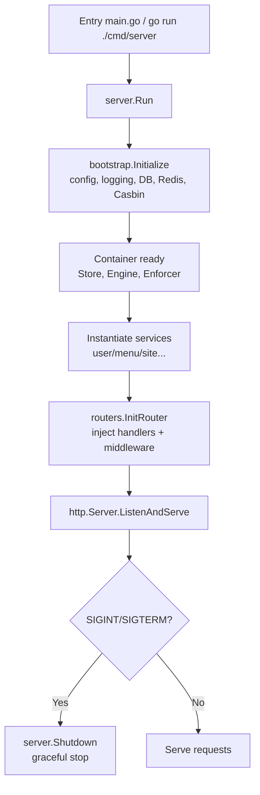

# Gin Web Admin

[中文说明](./readme_zh.md)

Gin-based admin backend featuring user/role management, CMS-style menu/content modules, Casbin authorization, Redis caching, and async route loading. Frontend companion: [web-admin-frontend](https://github.com/userfhy/web-admin-frontend).

## Table of Contents

1. [Highlights](#highlights)
2. [Project Layout](#project-layout)
3. [Quick Start](#quick-start)
4. [Configuration & Run Modes](#configuration--run-modes)
5. [Architecture & Boot Flow](#architecture--boot-flow)
6. [Redis & Caching Strategy](#redis--caching-strategy)
7. [Module Development Checklist](#module-development-checklist)
8. [Testing & Quality](#testing--quality)
9. [Observability & Logs](#observability--logs)
10. [Swagger API Docs](#swagger-api-docs)
11. [Parameter Validation Tips](#parameter-validation-tips)
12. [Cross Compilation](#cross-compilation)
13. [License](#license)

---

## Highlights

- 🧩 **Modular DI architecture** – services are instantiated in `cmd/server` and injected downstream via `routers -> controllers`, keeping dependencies explicit and testable.
- 🔐 **Layered authorization** – JWT + Redis blacklist + Casbin RBAC, plus async menu/route cache for faster front-end bootstrap.
- 🚀 **Redis caching suite** – categories/tags/content, async routes, JWT blacklist, etc., all reuse `utils/gredis` helpers with async set/delete.
- 🧭 **Swagger/OpenAPI ready** – `swag init` produces up-to-date API docs for easy integration.
- 🧰 **Utility toolbox** – pagination, validator wrappers, SSE helpers, logging, translation middleware.
- 🏗️ **Cross-platform builds** – sample scripts for Windows/Linux static binaries.
- 🔒 **Account security** – password complexity policy, IP whitelist, login lockouts, and audit logs for login/critical operations.

## Project Layout

```
├── cmd/server          # Entry point + dependency wiring
├── internal/bootstrap  # Config, DB, Redis, Casbin container
├── routers             # Router definitions & dependency struct
├── app
│   ├── controllers/v1  # HTTP handlers
│   ├── middleware      # JWT / Casbin / CORS / i18n
│   └── service/v1      # Business services (DB + cache access)
├── app/models          # GORM models & queries
├── utils               # gredis, pagination, logging, validator ...
├── conf                # TOML configs (sample)
├── docs                # Swagger outputs
├── sql                 # init / migration scripts
└── readme.md
```

## Quick Start

```bash
cp conf/app.toml.example conf/app.toml
go mod download
go run ./cmd/server
```

- Default listen address: `:8081` (`server.http_port` in `conf/app.toml`).
- `go run main.go` delegates to the same bootstrap logic.

## Configuration & Run Modes

- Config options live in `conf/app.toml`; copy the sample per environment (dev/stg/prod).
- `internal/setting` loads Redis/MySQL/JWT/Casbin/Server settings.
- Account policies (password complexity, IP whitelist, lockouts) live under the `[security]` section.
- Override via env vars for zero-touch deploys:

```bash
export APP_CONFIG_PATH=/path/to/app.toml   # custom config file
export RUN_MODE=release                    # override run_mode
go run ./cmd/server
```

Programmatic usage:

```go
_ = server.Run(server.Options{
    ConfigPath:      "./conf/app.toml",
    ShutdownTimeout: 10 * time.Second,
})
```

Need shared dependencies elsewhere? Call `bootstrap.Initialize` to reuse the container (DB, Redis pool, Gin engine, Casbin enforcer, ...).

## Architecture & Boot Flow

### Boot Flow Diagram


```mermaid
flowchart TD
    A[Entry main.go / go run ./cmd/server] --> B[server.Run]
    B --> C[bootstrap.Initialize<br/>config, logging, DB, Redis, Casbin]
    C --> D[Container ready<br/>Store, Engine, Enforcer]
    D --> E[Instantiate services<br/>user/menu/site...]
    E --> F[routers.InitRouter<br/>inject handlers + middleware]
    F --> G[http.Server.ListenAndServe]
    G --> H{SIGINT/SIGTERM?}
    H -->|Yes| I[server.Shutdown<br/>graceful stop]
    H -->|No| J[Serve requests]
```

> Custom launchers must follow the same order: bootstrap dependencies → create services/routers → start HTTP server + graceful shutdown.

### Dependency Injection Notes

1. `bootstrap.Initialize` builds `container.Store` (DB/GORM), `container.CasbinEnforcer`, Redis pool, etc.
2. `cmd/server/server.go` creates every `NewService` instance. Cross-service deps (e.g., auth → user) are passed through constructors.
3. `routers.Dependencies` carries services into controllers. Middlewares (e.g., `middleware.JWTHandler`) also receive dependencies explicitly (UserService now required).
4. Avoid reviving `SetDefaultService`-style globals—keep dependencies explicit for clarity and tests.

## Redis & Caching Strategy

All Redis access goes through `utils/gredis`, which provides sync/async set/delete, JSON helpers, prefix scans, etc. Always reuse this pool—no extra clients.

### Key Spaces & Suggested TTL

| Cache key/prefix            | Purpose                                | TTL/Policy           | Invalidated by                                     |
|----------------------------|----------------------------------------|----------------------|----------------------------------------------------|
| `site:categories:all`      | Public category list                   | `siteCacheTTL` = 15m | `sitePublicService.InvalidatePublicCategories()`   |
| `site:tags:all`            | Public tag list                        | `siteCacheTTL`       | `InvalidatePublicTags()`                           |
| `site:content:id:<id>`     | Content detail by ID                   | `siteCacheTTL`       | `InvalidatePublicContent(id, slug)`                |
| `site:content:slug:<slug>` | Content detail by slug                 | `siteCacheTTL`       | same as above                                      |
| `site:content:list:*`      | Paginated content list cache           | `siteCacheTTL`       | Any category/tag/content mutation (delete prefix)  |
| `sys:routes:<roleKey>`     | Async routes (menu tree)               | 10m                  | `sysService.InvalidateRouteCache()`                |
| `jwt:blacklist:<jwt>`      | JWT blacklist (logout/password change) | token remaining TTL  | `userService.JoinBlockList()`                      |

- `siteCacheTTL` defaults to 15 minutes. Raise/lower depending on DB pressure vs freshness requirements, but always call invalidators after writes.
- Prefer async helpers (`SetJSONAsync`, `DeleteByPrefixAsync`) to avoid blocking request goroutines.

### Verifying Redis Writes

1. **JWT blacklist**
   ```bash
   redis-cli --scan --pattern 'jwt:blacklist:*'
   redis-cli TTL jwt:blacklist:<token>
   ```
   Login stores the latest refresh token; logout/password change pushes the old token into the blacklist and clears DB refresh tokens.
2. **Site caches**
   ```bash
   redis-cli GET site:categories:all | jq
   redis-cli --scan --pattern 'site:content:list:*'
   ```
   After publishing/updating/deleting content/category/tag, ensure related keys are removed (WARN logs appear if deletion fails).
3. **Async routes**
   ```bash
   redis-cli --scan --pattern 'sys:routes:*'
   ```
   Role-menu binding changes should clear the prefix.

### FAQ

- **Why does JWT middleware still hit the DB?** Redis blacklist is checked first; DB queries only happen when Redis returns "not found" (or Redis is unavailable).
- **What else can be cached?** Consider frequently read reference data (dropdowns, public settings, announcements). Use a dedicated prefix + TTL + invalidator.

## Module Development Checklist

> Goal: keep advancing the "Service + Handler + Router + Tests" DI pattern while aligning cache/permission/docs.

1. **Models & migrations (`app/models`, `sql/`)** – define structs, relations, pagination queries; manage DDL scripts in `sql/`, avoid production AutoMigrate.
2. **Service layer (`app/service/v1/<module>`)** – `type Service struct { store *data.Store }`, inject other services if needed, expose receiver methods only, reuse `utils/gredis` for cache.
3. **Controllers / handlers** – implement `Handler` in `app/controllers/v1/<module>`, constructor must accept the service. Reuse `common.Gin`, `utils.GetPagination`, `utils/code`.
4. **Routers** – add `Init<Module>Router(group, handler)`; extend `routers.Dependencies` and wire the handler in `InitRouter`.
5. **Wiring** – instantiate `NewService` in `cmd/server/server.go` and populate the dependencies struct. Pass service pointers between modules explicitly.
6. **Cache/Redis** – read path checks cache first; writes must call invalidators (delete keys or prefixes) to keep public data fresh.
7. **Permissions/docs** – update menu SQL, Casbin policies, role-menu bindings as needed; rerun `swag init` for documentation.
8. **Validation** – `GOCACHE=/tmp/.gocache go test ./...`, `go run ./cmd/server` for manual verification; double-check Redis state for cache-heavy modules.

## Testing & Quality

| Scenario               | Command / Steps                                                |
|------------------------|----------------------------------------------------------------|
| Unit tests (all pkgs)  | `GOCACHE=/tmp/.gocache go test ./...`                          |
| Auth controller tests  | `go test ./app/controllers/v1/auth -run TestHandler_UserLogin` |
| HTTP e2e smoke         | `go test ./tests -run TestAuthLoginEndpoint`                   |
| JWT blacklist check    | Login → `redis-cli --scan 'jwt:blacklist:*'` → logout → TTL    |
| Site cache invalidation| Edit category/tag/content → `redis-cli --scan 'site:content:*'`|
| Route cache refresh    | Save role-menu bindings → `redis-cli --scan 'sys:routes:*'` (expect empty)|
| Swagger docs           | `swag init` → visit `BASE_URL/swagger/index.html`              |

> No redis-cli? Use `docker exec -it redis redis-cli` or a tiny Go helper that calls `utils/gredis`. Controller/e2e tests rely on the `AuthService` interface and mocked dependencies, so they run without touching DB/Redis, suitable for CI.

## Observability & Logs

```
$ go run main.go
2020/06/28 15:42:40 [info] Redis connected 192.168.3.5:6379 DB: 0
2020/06/28 15:42:40 PONG
[GIN-debug] POST /v1/api/login ...
INFO[2025-03-16 14:18:39] start http server listening :8081
```

Recommendations:

- Set `setting.ServerSetting.RunMode=release` or `GIN_MODE=release` in production.
- Keep INFO/WARN logs for cache invalidation, JWT blacklist writes, Casbin refreshes to simplify troubleshooting.
- Integrate with ELK/Loki/etc. by extending `utils/logging` if needed.

## Swagger API Docs

- Browse at `BASE_URL/swagger/index.html`.
- Generate via:

```bash
swag init
```

- Preview screenshots: `img/swagger_preview.png`, `img/swagger_preview_2.png`.

## Parameter Validation Tips

Using `validator.v10` through `common.CheckBindStructParameter`:

```go
type Page struct {
    P uint `json:"p" form:"p" validate:"required,numeric,min=1"`
    N uint `json:"n" form:"n" validate:"required,numeric,min=1"`
}

var page Page
if err := c.ShouldBindQuery(&page); err != nil { ... }
if err, msg := common.CheckBindStructParameter(page, c); err != nil {
    appG.Response(http.StatusBadRequest, code.InvalidParams, msg, nil)
    return
}
```

`utils.GetPagination` already parses `page/pageSize` (with max limits) and returns a helper that formats responses.

## Cross Compilation

```bash
# Windows
CGO_ENABLED=0 GOOS=windows GOARCH=amd64 \
  go build -a -ldflags '-extldflags "-static"' .

# Linux
CGO_ENABLED=0 go build -a -ldflags '-extldflags "-static"' .
```

## License

[MIT](./LICENSE)
