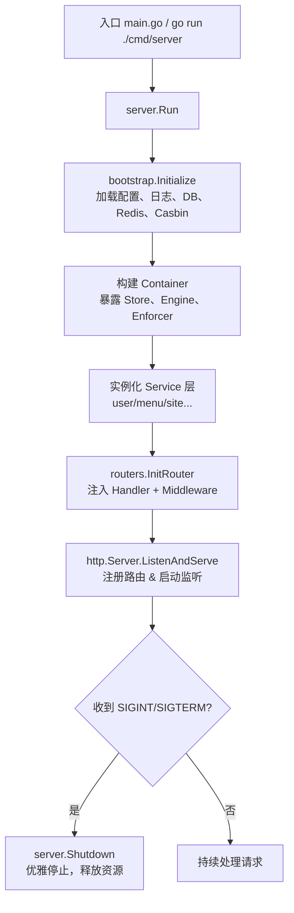

# Gin Web Admin

[English Version](./readme.md)

基于 Gin 的后台管理服务端，提供用户、角色、菜单、CMS/官网内容、Casbin 鉴权、Redis 缓存等能力。前端配套项目：[web-admin-frontend](https://github.com/userfhy/web-admin-frontend)。

## 快速入口

- 前端开发：先看 [前端如何调用字典](#前端如何调用字典) 和 [前后端联调指引](#前后端联调指引)
- 后端开发：先看 [架构与启动流程](#架构与启动流程) 和 [新增模块开发清单](#新增模块开发清单)
- 联调/排障：先看 [Redis 与缓存策略](#redis-与缓存策略) 和 [Swagger API 文档](#swagger-api-文档)

## 目录

1. [特性总览](#特性总览)
2. [目录结构](#目录结构)
3. [快速开始](#快速开始)
4. [配置与运行模式](#配置与运行模式)
5. [架构与启动流程](#架构与启动流程)
6. [Redis 与缓存策略](#redis-与缓存策略)
7. [前端如何调用字典](#前端如何调用字典)
8. [前后端联调指引](#前后端联调指引)
9. [新增模块开发清单](#新增模块开发清单)
10. [测试与质量保障](#测试与质量保障)
11. [观测与日志](#观测与日志)
12. [Swagger API 文档](#swagger-api-文档)
13. [参数校验指引](#参数校验指引)
14. [交叉编译](#交叉编译)
15. [License](#license)

---

## 特性总览

- 🧩 **模块化 DI 架构**：每个 Service 通过 `cmd/server -> routers -> controllers` 注入，易于测试与扩展。
- 🔐 **多级鉴权**：JWT + Redis 黑名单 + Casbin RBAC，支持异步路由缓存。
- 🚀 **Redis 缓存体系**：站点分类/标签/内容、动态菜单、JWT 黑名单等均有缓存与失效策略，统一封装在 `utils/gredis`。
- 🧭 **Swagger/OpenAPI**：`swag init` 自动生成接口文档，可快速联调。
- 🧰 **常用工具**：分页、结构体校验、基于 WebSocket 的监控推送、日志、配置热切换（通过环境变量指定）。
- 🏗️ **跨平台发布**：提供 Windows/Linux 静态编译脚本。
- 🔒 **账户安全**：强制密码复杂度、IP 白名单、登录失败锁定与登录/操作审计日志，满足合规要求。
- 📈 **运维监控**：提供在线用户、强制下线、审计日志与服务器监控快照/推送能力。

## 目录结构

```
├── cmd/server          # 程序入口与 DI 装配
├── internal/bootstrap  # 配置、DB、Redis、Casbin 初始化容器
├── routers             # 路由与依赖注入
├── app
│   ├── controllers/v1  # Handler 层
│   ├── middleware      # JWT / Casbin / CORS / i18n
│   └── service/v1      # 业务服务层（与数据、缓存交互）
├── app/models          # GORM 模型与查询
├── utils               # gredis、pagination、logging、validator 等
├── conf                # TOML 配置（示例）
├── docs                # Swagger 生成文件
├── sql                 # 初始化/迁移脚本
└── readme.md
```

## 快速开始

```bash
cp conf/app.toml.example conf/app.toml
go mod download
go run ./cmd/server
```

- 默认监听 `:8081`，可通过 `conf/app.toml` 的 `server.http_port` 调整。
- 若希望直接 `go run main.go`，其内部同样调用 `cmd/server`。

## 配置与运行模式

- 所有配置读取自 `conf/app.toml`，可以按照环境（dev/staging/prod）复制多份文件。
- `internal/setting` 会加载 Redis/MySQL/JWT/Casbin/Server 等配置项，可在 TOML 中逐项覆盖。
- 密码复杂度、IP 白名单、登录锁定等安全策略统一配置在 `[security]` 区域。
- 通过环境变量可实现“无侵入”覆盖：

```bash
export APP_CONFIG_PATH=/path/to/app.toml   # 指定配置
export RUN_MODE=release                    # 覆盖配置中的 run_mode
go run ./cmd/server
```

也可以在代码中直接：

```go
_ = server.Run(server.Options{
    ConfigPath:      "./conf/app.toml",
    ShutdownTimeout: 10 * time.Second,
})
```

若你有自定义 CLI，可重用 `internal/bootstrap.Initialize` 获取容器中的 `DB / Redis / Engine / CasbinEnforcer`。

## 架构与启动流程

### 启动流程图



> 自定义启动器应严格遵循上图：先初始化依赖容器，再创建 Service/Router，最后启动 HTTP Server 与优雅退出。

### 依赖注入要点

1. `bootstrap.Initialize` 会填充 `container.Store`（封装 DB/GORM）与 `container.CasbinEnforcer`。
2. 在 `cmd/server/server.go` 中创建各模块 `NewService` 实例；服务之间的依赖（例如 `auth` 依赖 `user`）通过构造函数显式传递。
3. `routers.Dependencies` 将 Service 注入 Handler；中间件（如 `middleware.JWTHandler`）也需要显式依赖（目前需要传 `UserService`）。
4. 禁止在包级再创建 `SetDefaultService` 或全局单例，避免跨模块隐式耦合。

## Redis 与缓存策略

项目统一通过 `utils/gredis` 访问 Redis（封装了同步/异步写、JSON 序列化、前缀删除等）。保持“复用现有连接池、不额外引第三方客户端”的原则。

适合阅读对象：后端开发、运维、以及需要确认 Redis key/缓存命中行为的前端同学。

### 关键缓存与建议 TTL

| 缓存 Key/前缀                    | 描述                              | TTL/策略             | 失效函数/入口                                   |
|----------------------------------|-----------------------------------|----------------------|------------------------------------------------|
| `site:categories:all`            | 官网分类列表                      | `[site].CacheTTL`（默认15m） | `sitePublicService.InvalidatePublicCategories` |
| `site:tags:all`                  | 官网标签列表                      | `[site].CacheTTL`             | `sitePublicService.InvalidatePublicTags`       |
| `site:content:id:<id>`           | 官网内容详情（ID）                | `[site].CacheTTL`             | `InvalidatePublicContent`                      |
| `site:content:slug:<slug>`       | 官网内容详情（Slug）              | `[site].CacheTTL`             | 同上                                           |
| `site:content:list:*`            | 官网内容列表分页 Cache            | `[site].CacheTTL`             | 分类/标签/内容写操作均触发删除前缀             |
| `sys:dict:data:<dictType>`       | 单个字典类型下的启用字典数据      | 持久化，手动刷新/写后重建     | `dictTypeService.RefreshDictCache`             |
| `sys:dict:data:all`              | 所有字典类型的缓存快照            | 持久化，手动刷新/写后重建     | `dictTypeService.RefreshDictCache`             |
| `sys:routes:<roleKey>`           | 动态菜单/路由树                   | 10m                  | `sysService.InvalidateRouteCache`              |
| `jwt:blacklist:<jwt>`            | JWT 黑名单（登录失效/退出）       | token 剩余有效期     | `userService.JoinBlockList`                    |

- 站点缓存 TTL 可通过 `conf/app.toml` 中的 `[site].CacheTTL`（Go duration 字符串，默认 `15m`）配置。若访问量大且后台改动频繁，可缩短 TTL；若更关注 DB 压力，可延长 TTL，但务必配合失效函数，避免陈旧数据。
- 新增缓存请优先使用 `SetJSONAsync` / `DeleteByPrefixAsync` 等异步方法，避免阻塞请求线程。

### 如何验证 Redis 写入

1. **登录/退出黑名单**
   ```bash
   redis-cli --scan --pattern 'jwt:blacklist:*'
   redis-cli TTL jwt:blacklist:<token>
   ```
   - 登录成功后，`SetLoggedUserInfo` 会记录最新 refresh_token，旧 token 会被 `JoinBlockList` 写入黑名单。
   - 退出或修改密码时会立即写黑名单并清空数据库中的 refresh_token。
2. **站点内容缓存**
   ```bash
   redis-cli GET site:categories:all | jq
   redis-cli --scan --pattern 'site:content:list:*'
   ```
   - 在后台发布/更新/删除内容、分类、标签后，观察对应 key 是否被删除（日志会输出 WARN 表示删除失败）。
3. **路由缓存**
   ```bash
   redis-cli --scan --pattern 'sys:routes:*'
   ```
   - 修改菜单或角色菜单关系后，`sysService.InvalidateRouteCache` 会清空 `sys:routes:*`。
4. **字典缓存**
   ```bash
   redis-cli --scan --pattern 'sys:dict:data:*'
   redis-cli GET sys:dict:data:sys_user_status | jq
   ```
   - 手动调用 `POST /v1/api/dict/type/refresh-cache` 后，应看到字典 key 被写入 Redis。
   - 新增/修改/删除字典类型、字典数据后，后端也会自动重建字典缓存。

### 常见问题

- **为何每次鉴权仍访问 DB？**  
  登录后的 JWT 会在 Redis 中维护黑名单，`middleware.JWTHandler` 优先查询 Redis，只有 Redis 未命中才会降级访问 DB。

- **字典接口什么时候会命中 Redis？**  
  当前 `GET /v1/api/dict/data` 在“按 `dictType` 精确查询、未传 `label`、且 `status=1`”时优先命中字典缓存；如果传了模糊搜索条件或空状态，仍会走数据库查询。

- **还能缓存什么？**  
  可以考虑缓存后台常用的下拉选项、公共设置、系统公告等读频高/写频低的数据。策略：使用统一前缀 + TTL + 写后失效函数。

## 前端如何调用字典

字典通常有两种前端用法：后台字典管理页、业务表单/列表中的字典回显。

适合阅读对象：前端开发，以及需要给前端提供字典接入规范的后端开发。

### 1. 后台字典管理页

- 获取字典类型列表：`GET /v1/api/dict/type`
- 获取全部启用字典类型：`GET /v1/api/dict/type/all?status=1`
- 获取某个字典的数据项：`GET /v1/api/dict/data?pageNum=1&pageSize=50&dictType=sys_user_status&status=1`
- 手动刷新 Redis 字典缓存：`POST /v1/api/dict/type/refresh-cache`

前端配套项目 `web-admin-frontend` 的实际封装可参考：

- `src/api/dictType.ts` 中的 `getDictTypeList / getAllDictTypes / refreshDictTypeCache`
- `src/api/dictData.ts` 中的 `getDictDataList`

### 2. 业务表单/表格中读取字典

推荐做法：

1. 页面初始化时按 `dictType + status=1` 拉取字典数据。
2. 将返回结果转成 `value -> label` 的 Map，用于表格回显。
3. 下拉框直接复用返回的 `label / value` 列表。
4. 若后台刚修改过字典，可先调用一次刷新缓存接口，再重新拉取字典数据。

示例（TypeScript）：

```ts
import { getDictDataList } from "@/api/dictData";

export async function loadUserStatusDict() {
  const res = await getDictDataList({
    pageNum: 1,
    pageSize: 50,
    dictType: "sys_user_status",
    status: 1
  });

  const list = res?.data?.list ?? [];
  const valueLabelMap = new Map(list.map(item => [item.value, item.label]));

  return {
    options: list.map(item => ({
      label: item.label,
      value: item.value
    })),
    valueLabelMap
  };
}
```

表格回显示例：

```ts
const { options, valueLabelMap } = await loadUserStatusDict();

const columns = [
  {
    label: "用户状态",
    prop: "status",
    formatter: ({ status }) => valueLabelMap.get(String(status)) ?? "-"
  }
];
```

### 3. 命中缓存的调用约定

如果你希望字典查询优先走 Redis，而不是每次都查数据库，前端请求最好遵循下面的约定：

- `dictType` 传精确值，例如 `sys_user_status`
- `status` 传 `1`
- 不传 `label`，避免触发模糊搜索路径

推荐：

```http
GET /v1/api/dict/data?pageNum=1&pageSize=50&dictType=sys_user_status&status=1
```

不推荐：

```http
GET /v1/api/dict/data?pageNum=1&pageSize=50&dictType=sys_user_status&status=
GET /v1/api/dict/data?pageNum=1&pageSize=50&dictType=sys_user_status&label=启
```

## 前后端联调指引

这一节面向前端同学，整理后台管理系统最常见的几个接入点。配套前端项目：`web-admin-frontend`。

适合阅读对象：第一次接入本项目后台接口的前端开发，或需要统一接口约定的全栈开发。

### 1. 登录与 Token 生命周期

推荐流程：

1. 调用登录接口，获取 `token / refreshToken`
2. 将 token 保存在前端存储中
3. 后续请求统一带上 `Authorization`
4. token 过期时调用刷新 token 接口
5. 退出登录时调用退出接口，而不是只清本地缓存

说明：

- 旧 token 会进入 Redis 黑名单
- 修改密码、退出登录后，前端应清空用户状态并跳回登录页
- 强制下线会同时清空 refresh_token 与在线会话；旧 access token 在下一次访问受保护接口时会被后端拒绝

### 2. 动态菜单与路由

后台菜单采用“角色 -> 菜单 -> 前端动态路由”的模式。

推荐接法：

1. 登录成功后先获取当前用户信息
2. 再调用动态路由接口获取当前角色可访问菜单
3. 前端将返回结果转换成异步路由并注册
4. 若后台修改了菜单或角色菜单关系，重新拉取动态路由即可

说明：

- 后端会缓存动态路由到 Redis：`sys:routes:<roleKey>`
- 菜单、角色、角色菜单变化后，后端会自动清理路由缓存

### 3. 字典

字典接入细节见上一节 [前端如何调用字典](#前端如何调用字典)。

这里仅保留一条总原则：

- 页面内统一复用同一份字典数据，不要在表格、表单、筛选项里重复请求同一个 `dictType`

### 4. 分页

后端统一支持这些分页参数别名：

- 页码：`pageNum` / `page` / `p`
- 每页数量：`pageSize` / `size` / `n`

建议前端统一固定传：

```ts
{
  pageNum: 1,
  pageSize: 10
}
```

常见分页响应结构：

```json
{
  "list": [],
  "total": 0,
  "pageSize": 10,
  "currentPage": 1,
  "pageCount": 0,
  "hasNext": false,
  "hasPrev": false
}
```

### 5. API 封装建议

建议前端按领域拆分 API 文件：

- `src/api/auth.ts`：登录、退出、刷新 token
- `src/api/user.ts`：当前用户信息
- `src/api/menu.ts` 或 `src/api/route.ts`：动态菜单/路由
- `src/api/dictType.ts`：字典类型、刷新缓存
- `src/api/dictData.ts`：字典数据

建议统一错误处理：

- 成功时读取 `res.data`
- 失败时优先展示 `res.msg || res.message`
- 对 `401` 统一做登录失效处理

### 6. 推荐接入顺序

如果你在一个新前端项目里从零接这个后台，建议顺序如下：

1. 登录、退出、刷新 token
2. 当前用户信息
3. 动态菜单/路由
4. 通用分页列表
5. 字典
6. 最后接业务详情页和表单页

## 新增模块开发清单

> 目标：继续推进 “Service + Handler + Router + 测试” 的依赖注入体系，并确保缓存/权限/文档同步。

适合阅读对象：准备新增后端模块、接口或缓存能力的开发者。

1. **模型与迁移（app/models + sql/）**  
   - 定义数据结构、关联、分页查询（复用 `utils.Pagination`）。  
   - 如需新表或字段，请在 `sql/` 维护脚本，禁止在生产库 AutoMigrate。

2. **Service 层（app/service/v1/<module>）**  
   - 声明 `type Service struct { store *data.Store }`，必要时注入其它 Service。  
   - 方法全部为接收者函数，若需要在 Controller 复用，考虑暴露 interface 方便 mock。  
   - Redis 相关操作统一调用 `utils/gredis`。

3. **Controller / Handler**  
   - `app/controllers/v1/<module>` 中实现 `Handler`，构造函数必须接收 Service。  
   - 统一使用 `common.Gin`、`utils.GetPagination`、`utils/code` 输出响应。

4. **Router 注册**  
   - 在 `routers/<module>_router.go` 定义 `Init<Module>Router(group, handler)`。  
   - `routers/router.go` 的 `Dependencies` 加字段，并在 `InitRouter` 中注入 Handler。

5. **依赖装配**  
   - `cmd/server/server.go` 中实例化 Service，并填入 `routers.Dependencies`。  
   - 若 Service 之间存在依赖（如 auth -> user），通过构造函数传指针。

6. **缓存/Redis**  
   - 读操作：优先检查缓存，命中后提前返回；未命中时查询 DB 并异步写入 Redis。  
   - 写操作：务必调用失效函数，删除相关 key 或前缀。

7. **权限/文档**  
   - 视情况补充菜单 SQL、Casbin Policy、角色-菜单关系。  
   - 路由更新后需运行 `swag init`，保证 Swagger 同步。

8. **验证**  
   - `GOCACHE=/tmp/.gocache go test ./...`。  
   - `go run ./cmd/server` 手测新路由。  
   - 若涉及 Redis，参考上一节确认缓存/黑名单写入。

## 测试与质量保障

适合阅读对象：提交代码前需要自测、联调或排查回归问题的开发者。

| 场景                | 指令/步骤                                                       |
|---------------------|----------------------------------------------------------------|
| 全量单元测试        | `GOCACHE=/tmp/.gocache go test ./...`                          |
| Auth 控制器单测     | `go test ./app/controllers/v1/auth -run TestHandler_UserLogin` |
| HTTP E2E 冒烟       | `go test ./tests -run TestAuthLoginEndpoint`                   |
| Redis 黑名单验证    | 登录→`redis-cli --scan 'jwt:blacklist:*'`→退出→确认 TTL 更新   |
| 站点缓存失效        | 修改分类/标签/文章→`redis-cli --scan 'site:content:*'`         |
| 路由缓存刷新        | 绑定角色-菜单→`redis-cli --scan 'sys:routes:*'` 应为空         |
| Swagger 文档        | `swag init` → 访问 `BASE_URL/swagger/index.html`               |

> 如果 `redis-cli` 不可用，可以使用 `docker exec -it redis redis-cli` 或者编写简单 Go 脚本调用 `utils/gredis`。控制器/E2E 测试通过接口模拟 AuthService，因此无需真实 DB/Redis，适合 CI。

### Git 钩子

- 仓库提供 `githooks/pre-commit`，执行 `git config core.hooksPath githooks` 即可启用本地钩子。
- 钩子要求本地安装 `golangci-lint` v2，并会顺序执行 `golangci-lint run` 与 `GOCACHE=/tmp/gocache go test ./...`，确保与 CI 一致，失败则阻止提交。
- 临时跳过可设置 `SKIP_GIT_HOOKS=1` 再提交（请在修复后恢复）。

## 观测与日志

适合阅读对象：需要排查运行问题、缓存失效问题或上线日志问题的开发者/运维。

默认日志输出包含 Redis 连接、Gin 路由注册等信息：

```bash
$ go run main.go
2020/06/28 15:42:40 [info] Redis connected 192.168.3.5:6379 DB: 0
2020/06/28 15:42:40 PONG
[GIN-debug] POST /v1/api/login ...
...
INFO[2025-03-16 14:18:39] start http server listening :8081
```

建议在生产中：

- 通过 `setting.ServerSetting.RunMode=release` 或 `export GIN_MODE=release` 控制 Gin 日志。
- 为缓存、JWT 黑名单、Casbin 等关键操作保留 INFO/WARN 日志，方便排障。
- 配置日志收集（如 Loki、ELK）可在 `utils/logging` 中扩展。
- 服务器监控同时提供 REST 快照接口 `GET /v1/api/sys/server-monitor` 与 WebSocket 推送接口 `GET /v1/api/sys/server-monitor/ws?token=<accessToken>`。
- 前端“登录日志 / 操作日志 / 系统日志”页面均基于 `gin_audit_log` 表。
- 在线用户与强制下线依赖 Redis 在线会话；若 Redis 未启用，该功能不可用。

## Swagger API 文档

适合阅读对象：需要快速查接口定义、请求参数和响应结构的前后端开发。

- 访问地址：`BASE_URL/swagger/index.html`
- 生成命令：

```bash
swag init
```

- 预览截图：`img/swagger_preview.png` & `img/swagger_preview_2.png`

## 参数校验指引

适合阅读对象：需要新增请求参数校验、翻译提示或表单校验规则的后端开发。

项目使用 `validator.v10`，并封装在 `common.CheckBindStructParameter`：

```go
type Page struct {
    P uint `json:"p" form:"p" validate:"required,numeric,min=1"`
    N uint `json:"n" form:"n" validate:"required,numeric,min=1"`
}

var page Page
if err := c.ShouldBindQuery(&page); err != nil { ... }
if msg, err := common.CheckBindStructParameter(page, c); err != nil {
    appG.Response(http.StatusBadRequest, code.InvalidParams, msg, nil)
    return
}
```

`utils.GetPagination` 额外封装了 page/pageSize 解析与最大值限制，可直接复用。

## 交叉编译

```bash
# Windows
CGO_ENABLED=0 GOOS=windows GOARCH=amd64 \
  go build -a -ldflags '-extldflags "-static"' .

# Linux
CGO_ENABLED=0 go build -a -ldflags '-extldflags "-static"' .
```

## License

[MIT](./LICENSE)
