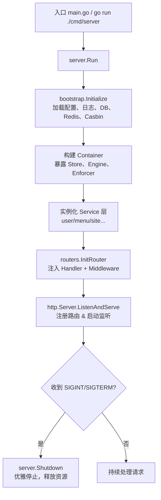

# Gin Web Admin

[English Version](./readme.md)

基于 Gin 的后台管理服务端，提供用户、角色、菜单、CMS/官网内容、Casbin 鉴权、Redis 缓存等能力。前端配套项目：[web-admin-frontend](https://github.com/userfhy/web-admin-frontend)。

## 目录

1. [特性总览](#特性总览)
2. [目录结构](#目录结构)
3. [快速开始](#快速开始)
4. [配置与运行模式](#配置与运行模式)
5. [架构与启动流程](#架构与启动流程)
6. [Redis 与缓存策略](#redis-与缓存策略)
7. [新增模块开发清单](#新增模块开发清单)
8. [测试与质量保障](#测试与质量保障)
9. [观测与日志](#观测与日志)
10. [Swagger API 文档](#swagger-api-文档)
11. [参数校验指引](#参数校验指引)
12. [交叉编译](#交叉编译)
13. [License](#license)

---

## 特性总览

- 🧩 **模块化 DI 架构**：每个 Service 通过 `cmd/server -> routers -> controllers` 注入，易于测试与扩展。
- 🔐 **多级鉴权**：JWT + Redis 黑名单 + Casbin RBAC，支持异步路由缓存。
- 🚀 **Redis 缓存体系**：站点分类/标签/内容、动态菜单、JWT 黑名单等均有缓存与失效策略，统一封装在 `utils/gredis`。
- 🧭 **Swagger/OpenAPI**：`swag init` 自动生成接口文档，可快速联调。
- 🧰 **常用工具**：分页、结构体校验、SSE、日志、配置热切换（通过环境变量指定）。
- 🏗️ **跨平台发布**：提供 Windows/Linux 静态编译脚本。
- 🔒 **账户安全**：强制密码复杂度、IP 白名单、登录失败锁定与登录/操作审计日志，满足合规要求。

## 目录结构

```
├── cmd/server          # 程序入口与 DI 装配
├── internal/bootstrap  # 配置、DB、Redis、Casbin 初始化容器
├── routers             # 路由与依赖注入
├── app
│   ├── controllers/v1  # Handler 层
│   ├── middleware      # JWT / Casbin / CORS / i18n
│   └── service/v1      # 业务服务层（与数据、缓存交互）
├── app/models          # GORM 模型与查询
├── utils               # gredis、pagination、logging、validator 等
├── conf                # TOML 配置（示例）
├── docs                # Swagger 生成文件
├── sql                 # 初始化/迁移脚本
└── readme.md
```

## 快速开始

```bash
cp conf/app.toml.example conf/app.toml
go mod download
go run ./cmd/server
```

- 默认监听 `:8081`，可通过 `conf/app.toml` 的 `server.http_port` 调整。
- 若希望直接 `go run main.go`，其内部同样调用 `cmd/server`。

## 配置与运行模式

- 所有配置读取自 `conf/app.toml`，可以按照环境（dev/staging/prod）复制多份文件。
- `internal/setting` 会加载 Redis/MySQL/JWT/Casbin/Server 等配置项，可在 TOML 中逐项覆盖。
- 密码复杂度、IP 白名单、登录锁定等安全策略统一配置在 `[security]` 区域。
- 通过环境变量可实现“无侵入”覆盖：

```bash
export APP_CONFIG_PATH=/path/to/app.toml   # 指定配置
export RUN_MODE=release                    # 覆盖配置中的 run_mode
go run ./cmd/server
```

也可以在代码中直接：

```go
_ = server.Run(server.Options{
    ConfigPath:      "./conf/app.toml",
    ShutdownTimeout: 10 * time.Second,
})
```

若你有自定义 CLI，可重用 `internal/bootstrap.Initialize` 获取容器中的 `DB / Redis / Engine / CasbinEnforcer`。

## 架构与启动流程

### 启动流程图



> 自定义启动器应严格遵循上图：先初始化依赖容器，再创建 Service/Router，最后启动 HTTP Server 与优雅退出。

### 依赖注入要点

1. `bootstrap.Initialize` 会填充 `container.Store`（封装 DB/GORM）与 `container.CasbinEnforcer`。
2. 在 `cmd/server/server.go` 中创建各模块 `NewService` 实例；服务之间的依赖（例如 `auth` 依赖 `user`）通过构造函数显式传递。
3. `routers.Dependencies` 将 Service 注入 Handler；中间件（如 `middleware.JWTHandler`）也需要显式依赖（目前需要传 `UserService`）。
4. 禁止在包级再创建 `SetDefaultService` 或全局单例，避免跨模块隐式耦合。

## Redis 与缓存策略

项目统一通过 `utils/gredis` 访问 Redis（封装了同步/异步写、JSON 序列化、前缀删除等）。保持“复用现有连接池、不额外引第三方客户端”的原则。

### 关键缓存与建议 TTL

| 缓存 Key/前缀                    | 描述                              | TTL/策略             | 失效函数/入口                                   |
|----------------------------------|-----------------------------------|----------------------|------------------------------------------------|
| `site:categories:all`            | 官网分类列表                      | `siteCacheTTL`=15m   | `sitePublicService.InvalidatePublicCategories` |
| `site:tags:all`                  | 官网标签列表                      | `siteCacheTTL`=15m   | `sitePublicService.InvalidatePublicTags`       |
| `site:content:id:<id>`           | 官网内容详情（ID）                | `siteCacheTTL`       | `InvalidatePublicContent`                      |
| `site:content:slug:<slug>`       | 官网内容详情（Slug）              | `siteCacheTTL`       | 同上                                           |
| `site:content:list:*`            | 官网内容列表分页 Cache            | `siteCacheTTL`       | 分类/标签/内容写操作均触发删除前缀             |
| `sys:routes:<roleKey>`           | 动态菜单/路由树                   | 10m                  | `sysService.InvalidateRouteCache`              |
| `jwt:blacklist:<jwt>`            | JWT 黑名单（登录失效/退出）       | token 剩余有效期     | `userService.JoinBlockList`                    |

- `siteCacheTTL` 默认 15 分钟。若访问量大且后台改动频繁，可缩短 TTL（修改常量或提炼为配置）；若更关注 DB 压力，可延长至 30 分钟，但务必保证每次写操作调用相应失效函数，避免用户看到过期数据。
- 新增缓存请优先使用 `SetJSONAsync` / `DeleteByPrefixAsync` 等异步方法，避免阻塞请求线程。

### 如何验证 Redis 写入

1. **登录/退出黑名单**
   ```bash
   redis-cli --scan --pattern 'jwt:blacklist:*'
   redis-cli TTL jwt:blacklist:<token>
   ```
   - 登录成功后，`SetLoggedUserInfo` 会记录最新 refresh_token，旧 token 会被 `JoinBlockList` 写入黑名单。
   - 退出或修改密码时会立即写黑名单并清空数据库中的 refresh_token。
2. **站点内容缓存**
   ```bash
   redis-cli GET site:categories:all | jq
   redis-cli --scan --pattern 'site:content:list:*'
   ```
   - 在后台发布/更新/删除内容、分类、标签后，观察对应 key 是否被删除（日志会输出 WARN 表示删除失败）。
3. **路由缓存**
   ```bash
   redis-cli --scan --pattern 'sys:routes:*'
   ```
   - 修改菜单或角色菜单关系后，`sysService.InvalidateRouteCache` 会清空 `sys:routes:*`。

### 常见问题

- **为何每次鉴权仍访问 DB？**  
  登录后的 JWT 会在 Redis 中维护黑名单，`middleware.JWTHandler` 优先查询 Redis，只有 Redis 未命中才会降级访问 DB。

- **还能缓存什么？**  
  可以考虑缓存后台常用的下拉选项、公共设置、系统公告等读频高/写频低的数据。策略：使用统一前缀 + TTL + 写后失效函数。

## 新增模块开发清单

> 目标：继续推进 “Service + Handler + Router + 测试” 的依赖注入体系，并确保缓存/权限/文档同步。

1. **模型与迁移（app/models + sql/）**  
   - 定义数据结构、关联、分页查询（复用 `utils.Pagination`）。  
   - 如需新表或字段，请在 `sql/` 维护脚本，禁止在生产库 AutoMigrate。

2. **Service 层（app/service/v1/<module>）**  
   - 声明 `type Service struct { store *data.Store }`，必要时注入其它 Service。  
   - 方法全部为接收者函数，若需要在 Controller 复用，考虑暴露 interface 方便 mock。  
   - Redis 相关操作统一调用 `utils/gredis`。

3. **Controller / Handler**  
   - `app/controllers/v1/<module>` 中实现 `Handler`，构造函数必须接收 Service。  
   - 统一使用 `common.Gin`、`utils.GetPagination`、`utils/code` 输出响应。

4. **Router 注册**  
   - 在 `routers/<module>_router.go` 定义 `Init<Module>Router(group, handler)`。  
   - `routers/router.go` 的 `Dependencies` 加字段，并在 `InitRouter` 中注入 Handler。

5. **依赖装配**  
   - `cmd/server/server.go` 中实例化 Service，并填入 `routers.Dependencies`。  
   - 若 Service 之间存在依赖（如 auth -> user），通过构造函数传指针。

6. **缓存/Redis**  
   - 读操作：优先检查缓存，命中后提前返回；未命中时查询 DB 并异步写入 Redis。  
   - 写操作：务必调用失效函数，删除相关 key 或前缀。

7. **权限/文档**  
   - 视情况补充菜单 SQL、Casbin Policy、角色-菜单关系。  
   - 路由更新后需运行 `swag init`，保证 Swagger 同步。

8. **验证**  
   - `GOCACHE=/tmp/.gocache go test ./...`。  
   - `go run ./cmd/server` 手测新路由。  
   - 若涉及 Redis，参考上一节确认缓存/黑名单写入。

## 测试与质量保障

| 场景                | 指令/步骤                                                       |
|---------------------|----------------------------------------------------------------|
| 单元测试            | `GOCACHE=/tmp/.gocache go test ./...`                          |
| Redis 黑名单验证    | 登录→`redis-cli --scan 'jwt:blacklist:*'`→退出→确认 TTL 更新   |
| 站点缓存失效        | 修改分类/标签/文章→`redis-cli --scan 'site:content:*'`         |
| 路由缓存刷新        | 绑定角色-菜单→`redis-cli --scan 'sys:routes:*'` 应为空         |
| Swagger 文档        | `swag init` → 访问 `BASE_URL/swagger/index.html`               |

> 如果 `redis-cli` 不可用，可以使用 `docker exec -it redis redis-cli` 或者编写简单 Go 脚本调用 `utils/gredis`。

## 观测与日志

默认日志输出包含 Redis 连接、Gin 路由注册等信息：

```bash
$ go run main.go
2020/06/28 15:42:40 [info] Redis connected 192.168.3.5:6379 DB: 0
2020/06/28 15:42:40 PONG
[GIN-debug] POST /v1/api/login ...
...
INFO[2025-03-16 14:18:39] start http server listening :8081
```

建议在生产中：

- 通过 `setting.ServerSetting.RunMode=release` 或 `export GIN_MODE=release` 控制 Gin 日志。
- 为缓存、JWT 黑名单、Casbin 等关键操作保留 INFO/WARN 日志，方便排障。
- 配置日志收集（如 Loki、ELK）可在 `utils/logging` 中扩展。

## Swagger API 文档

- 访问地址：`BASE_URL/swagger/index.html`
- 生成命令：

```bash
swag init
```

- 预览截图：`img/swagger_preview.png` & `img/swagger_preview_2.png`

## 参数校验指引

项目使用 `validator.v10`，并封装在 `common.CheckBindStructParameter`：

```go
type Page struct {
    P uint `json:"p" form:"p" validate:"required,numeric,min=1"`
    N uint `json:"n" form:"n" validate:"required,numeric,min=1"`
}

var page Page
if err := c.ShouldBindQuery(&page); err != nil { ... }
if err, msg := common.CheckBindStructParameter(page, c); err != nil {
    appG.Response(http.StatusBadRequest, code.InvalidParams, msg, nil)
    return
}
```

`utils.GetPagination` 额外封装了 page/pageSize 解析与最大值限制，可直接复用。

## 交叉编译

```bash
# Windows
CGO_ENABLED=0 GOOS=windows GOARCH=amd64 \
  go build -a -ldflags '-extldflags "-static"' .

# Linux
CGO_ENABLED=0 go build -a -ldflags '-extldflags "-static"' .
```

## License

[MIT](./LICENSE)
